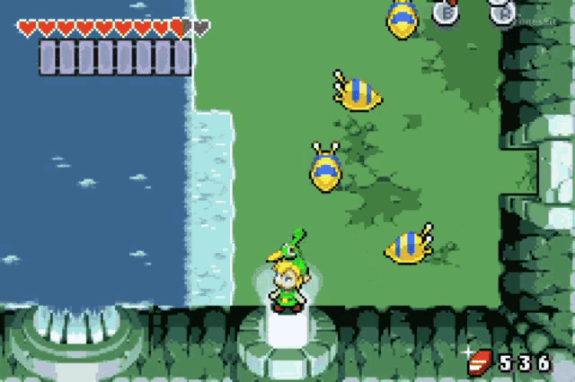

This research project has been studied and completed by [Martí Buxeda Sardans](https://github.com/BooStarGamer) in the "Design & Development of Videogames" degree, realized in the Tech Talent Center CITM/UPC university. This project was supported by [Ramon de Santa Maria](https://github.com/raysan5), the teacher of the subject "Project II".

# What is AI in RPG games actually?

Nowadays, the RPG world is in fight, all the companies wants to make something unique based in the roleplay of a character, and how the player interacts with it in order to achieve its final mission to successfully end the game. In those games, as the main name says, the player needs to feel like it is the real character in that specific situation, so the player needs intelligent inputs from outside (not just the character) in order to achieve that realism.

Here is when AI is coming to help us, to make things seems to dicede by its own, things be realistic and not feeling you are the only one alive there! So what we can understand as AI in enemies (or even NPC)? 

  - AI in enemies occurs when through an algorithm, the entity can decide, act or give a response by itself without any kind of player input.

Finally, we can conclude that the main porpouse of AI in RPG is to give a realistic response to a player action as well as imitating what could be real in our world. This statement also is correct when we talk about certain NPC, but we are going to talk about it later!

# Where could we find AI in an RPG?

## Enemies

In the enemy field we can find AI in a lot of places, so we want the game to feel realistic and each entity seem to have its own decisions. In this case, there are a couple of places where we can find this kind of inteligence, such as:

### -  Enemy default live movement: 
Sometimes, we can see enemies walking around the the rocky ground of our game searching for a player to attack. That movement which makes them feel alive is based in an Artificial Inteligence, using some directions and reference points, the enemy can automatically & randomly choose where to walk. When is out of its defined zone, turns around to move in another direction. Generating this events we can achieve that realism we are searching.

### - Enemy live chasing:
Once you have admired the beautiful choices the enemy decides to move around, it is time to go in action! When the player gets close to an specefic enemy, sometimes this starts to chase the player to "play with they". The transition of detecting the player is close, and decide to chase it sticks inside the definition of AI of an enemy. Next time you'll think twice before get close to an enemy!

### - Combat choice
One of the most important features of an RPG with turnbased combats as well as live combats (like Zelda games), the choice an enemy has to do to defeat the player. It is not that easy, because the enemy has to take care of killing the playing as well as not be killed. It is an important part of this kind of games, but also the one that makes an RPG being amazing!

## NPC

In the case of NPC, there are a lot of features where we can include AI, but this research is about enemies AI, so I am going to explain briefly some examples because I think it is pretty similar with enemies AI, apart from being interesting too.

### - Player following or combat help (between other options)
NPC can have the same characteristics than an enemy but in a peaceful way. Can follow the player to accompany it in its adventures, or can help in a combat choosing their action against the enemy.

 

