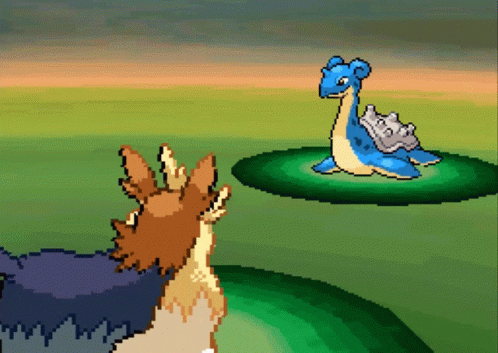

This research project has been studied and completed by [Martí Buxeda Sardans](https://github.com/Ar-Ess) in the "Design & Development of Videogames" degree, realized in the Tech Talent Center CITM/UPC university. This project was supported by [Ramon de Santa Maria](https://github.com/raysan5), the teacher of the subject "Project II".

# Index
1. [What is AI in RPG](#what-is-ai-in-rpg)
2. [Where is AI in an RPG](#where-is-ai-in-an-rpg)
   1. [Enemies](#enemies)
   2. [NPC](#enemies)
3. [Brain structure in combats](#brain-structure-in-combats)
   1. [Tryhard Mode](#tryhard-mode)
   2. [Defensive Mode](#defensive-mode)
   3. [Balanced Mode](#balanced-mode)
4. [Intelligence Level](#intelligence-level)
5. [Enemy Behaviour Types](#enemy-behaviour-types)
   1. [Static Natural](#static-natural)
   2. [Static Turn Based](#static-turn-based)
   3. [Live Natural](#live-natural)
   4. [Live Turn Based](#live-turn-based)
   5. [Others...](#others)
6. [Conclusions](#conclusions)

***

# Introduction

# What is AI in RPG

Nowadays, the RPG world is in a fight, all the companies want to make something unique based on the roleplay of a character, and how the player interacts with it in order to achieve its final mission to successfully end the game. In those games, as the main name says, the player needs to feel like it is the real character in that specific situation, so the player needs intelligent inputs from outside (not just the character) in order to achieve that realism.

Here is when AI is coming to help us, to make things seem to decide on their own, things be realistic and not feeling you are the only one alive there! So what we can understand as AI in enemies (or even NPC)? 

  - AI in RPG occurs when through an algorithm, an entity can decide, change or give a response by itself without any kind of player input.

So, we could reduce this definition for enemies like that:
  - AI in enemies occurs when through an algorithm, the entity can decide, change or give a response by itself without any kind of player input.

Finally, we can conclude that the main purpose of AI in RPG is to give a realistic response to a player's action as well as imitating what could be real in our world. This statement also is correct when we talk about certain NPC, but we are going to talk about it later!

***

# Where is AI in an RPG

## Enemies

In the enemy field, we can find AI in a lot of places, so we want the game to feel realistic and each entity seems to have its own decisions. In this case, there are a couple of places where we can find this kind of intelligence, such as:

### -  Enemy default live movement: 
Sometimes, we can see enemies walking around the rocky ground of our game searching for a player to attack. That movement that makes them feel alive is based on an Artificial Intelligence, using some directions and reference points, the enemy can automatically & randomly choose where to walk. When is out of its defined zone, turns around to move in another direction. By generating these events we can achieve that realism we are searching for.

### - Enemy live chasing:
Once you have admired the beautiful choices the enemy decides to move around, it is time to go into action! When the player gets close to a specific enemy, sometimes this starts to chase the player to "play with them". The transition of detecting the player is close, and decide to chase it sticks inside the definition of AI of an enemy. Next time you'll think twice before get close to an enemy!

### - Combat choice
One of the most important features of an RPG with turn-based combats as well as live combats (like Zelda games), the choice an enemy has to do to defeat the player. It is not that easy, because the enemy has to take care of killing the playing as well as not be killed. It is an important part of this kind of game, but also the one that makes an RPG being amazing!

## NPC

In the case of NPC, there are a lot of features where we can include AI, but this research is about enemies AI, so I am going to explain briefly some examples because I think it is pretty similar to enemies AI, apart from being interesting too.

### - Player following or combat help (between other options)
NPC can have the same characteristics as an enemy but in a peaceful way. Can follow the player to accompany it in its adventures, or can help in a combat choosing their action against the enemy.

 

***

# Brain structure in combats

When an enemy appears in combat against the player, there are several ways the developer can focus on the strategy of the enemy itself. Not all enemies have the same attitude. In fact, in a realistic game, we should make every enemy behave differently. That's why the brain structure, which determines the attitude of the enemy, better said, its decisions, should be well designed so the player can enjoy even more this game.

In this research project, I am going to generalize a lot with the brain structures, catching the bases of all existent ones. Meanwhile, I was searching for information, looking into videos, I saw some basic concepts every enemy starts with. Obviously, the name of each one is invented by me, there is not an official denomination actually. These are the following ones:

## Tryhard mode
In the tryhard mode, the enemy focus is the life of the character, which is its only reason to fight. Its own life has no importance meanwhile the player is alive, that's why its only choices are focused on attacking to hurt the player.

## Defensive mode
In this case, the enemy is just focused on its life/health and also receiving the less damage possible. This is the case of buff enemies, or healers, which 90% of the times are restoring its life as well as buffing its stats.

## Balanced mode
Here we have the balanced mode, which is a division between the last ones. This is the most used because upgrades the level of reality in the game. In case the enemy has a high amount of life, it commits a 75% tryhard & 25% defensive. When it is below the usual health points, the percentages inverts completely. The balanced focus on the player's life when enemies life is okay and vice-versa.

One good example for a balanced design could be to generate a direct relationship between player's health and enemies health. So when a certain number is overcome, change the focus directly to not get killed.

We can suppose our player's health is 40/50 HP.
We can suppose our enemy's health is 79/90 HP.

We can divide the actual health of each entity and create a brain structure which attitude is the following one:
 - When the enemy's health is lower than the player's health, turn to defensive mode.
 - When the enemy's health is higher than the player's health, turn to tryhard mode.

We can do that with this formula:

Enemy's health / Player's health  = 79 / 40  = 1,975 (focus mode)
 
 - In case focus mode is bigger equal than 1 --> TRYHARD MODE

 - In case focus mode is lower than 1 --> DEFENSIVE MODE

***

# Intelligence level

The intelligence level of an enemy determines whether its decisions are dumb or super smart, regarding each moment/turn it has to defeat the player. It is a good option to develop an algorithm that allows us to decide how intelligent is the enemy. Actually, there are a lot of pre-defined algorithms which even make enemies learn from their errors. We are not going that far, but using the last terms (Brain structures) we can set up the difference in intelligence. It is important to mention that whether the enemy is smarter than others can be a totally-apart feature regarding its LVL of experience. The enemy can be lvl 79, but be so dumb. Normally this kind of concepts are related to easy-to-kill enemies (dumb) vs. bosses (smarter).

Without further do, here you can see the direct relationship between the Brain structures, the respective usual lvl of experience, and its lvl of intelligence:

***

# Enemy Behaviour Types

For every original RPG game, there is a different enemy behavior. It is important to know about this topic which would be the one that will make our game shine. It important to distinguish the enemy behavior from the combat system, it is not the same. We can be, for example, in a live combat system and fight in a Link-usual game or a Cadence of Hyrule style. Both are live combat systems, but the enemy behavior is different. Usually, the term "enemy behavior" can match with the creative mechanics of each game.

Now I am going to list some types of enemy behavior:

## Static Natural 
#### Cadence of Hyrule
The static natural is a strange combination, there are a few enemies of them. In this case, Cadence of Hyrule presents some enemies which attitude is static but attacking the player at the rhythm of the music. Natural comes from the sense which the enemy is located in the same place the player is, so there's no need to enter a new scene to defeat the enemy itself.

## Static Turn Based
#### Pokemon
In this type of behavior the enemy does not move from its position, meaning of "static". And obviously, due to the combat system, we add the "Turn-based". This eases the developer's life because the attacks are predefined and there has not to be any type of physics neither collisions. The enemy just chooses the attack and then makes the action from its position.

## Live Natural
#### TLOZ
In this case, The Legend of Zelda RPG classic games are perfect. The enemies attack in a "live" way, its position are changing, their attacks as well depending on the player's actions. Obviously, we call it natural because the enemy stands in the same scene the story is told.

## Live Turn Based
#### Mario & Luigi saga
Mario & Luigi saga has been a revolution in the turn-based combat systems, making the enemies take a live place in the fight. As you can see in the link below, the enemies move towards the player, involving collisions and physics, so the player is able to dodge it also live.

[Video for reference](https://youtu.be/rbhcpTDpm-o?t=1335)

## Others
Finally, we reach the part where your mind has to fly in order to search new type of enemies behaviors. In this case, is a turn-based combat in which the "enemy" just attacks if it's been attacked previously, so the main mechanic of the game is to tame the enemy, not to kill them.

# Conclusions

To conclude this research work, I wanted to come up with some basic rules to take care of when designing an enemy and its AI. That's also what I learned from it:

  - Do not copy the same enemies from other games, try to change them a little bit. The small effort in changing something of its behavior is training yourself for a future you can be even more creative.

  - Think as you were the player in that situation, agains who would you like to fight, how would you like to avoid its attacks?

  - Invert the structural rules. What if it's the enemy which has to run from you? What if the combat is "How to escape from this enemy" instead of "Defeating it"?

  - GIT GUD. Something that catches the player attention about one enemy is its capacity of make fun of itself, through maybe its attacks or some conversations. Also, will help the game be challenging, because of the distraction of the player.
